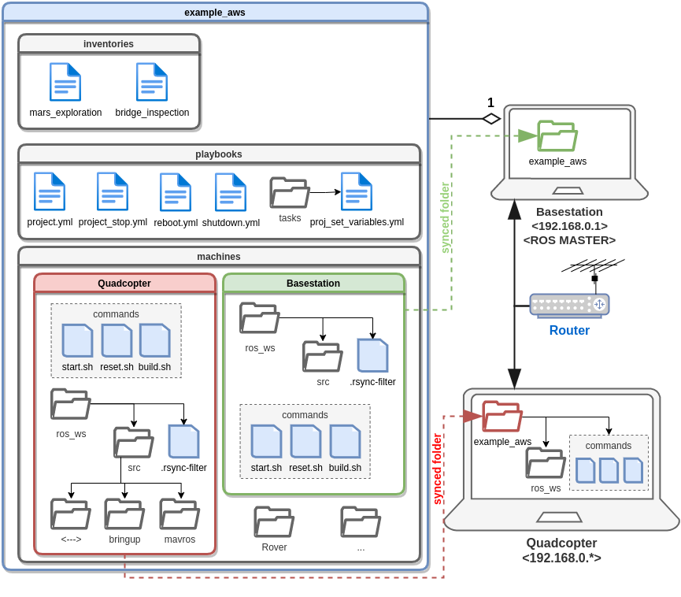

# example_aws

In this project provides a template to manage robots with Ansible. Using the so-called 
[ansible playbooks](./playbooks), we can modify the behavior and configuration of robots instead of modifying robots directly. This way robots can be easily reconfigured and cloned, thus the fleet will scale nicely.

The interesting part in this repository is a method to manage and deploy
projects on robots. It is described in the "Usage" section.

## Name
The suffic `_aws` stands for `ansible workspace`. Thus if you intend to create your own, it is suggested to keep the suffice, since multiple `_aws` can be available on your robot -- each for a different mission.

## Installation on Host

In order to use those playbooks you will need to install `ansible` >= 2.4 with apt-get 
`sudo apt  install ansible -y` (check the version with `ansible --version`). `rsync` is also needed to synchronize files with robots and is already included in the linux distributions. 

**NOTE**: your remote machines need to be reachable via `ssh`. You need to [setup a ssh key](https://www.ssh.com/academy/ssh/copy-id). 

### Requirements on Machine

* `ssh server`: must be running and the HOST need to be authorized.
* `tmux`: missions will be running in a session called `robot_session`. 
* `IP address`: the IP address needs to be known and in best case static. Scan the IP addressed in network by, e.g., `nmap -sn 192.168.1.0/24`.
* `username`: default is `pi`, but can be changed in inventory.


## Description

As shown in the block diagram, the `aws` has 3 main components
* inventories: containing an IP address lookup table for the machines used for a certain mission (each mission can require a different number and set of robots)
* playbooks: contains `ansible`  commands that are executed to manage robots. Manage means: configure, run, stop, reboot, etc. It is open for additions and extensions. 
* machines: contains per machine different software stacks (in our case ROS1 workspaces) which are synchronized with a local directory on the machine's home directory needed to achieve the mission of this `aws`.    



### inventories

To use the ansible playbooks you will need to create an inventory file
containing all robots that you will manage and definition of variables.

Example:
```
########### Quadcopter ############
[quadcopters]
q01 ansible_host=192.168.0.201
q02 ansible_host=192.168.0.202

[quadcopters:vars]
robot_name=quadcopter
username=pi
additional_packages=[]

############# Rovers ##############
[rovers]
r01 ansible_host=192.168.0.101
r02 ansible_host=192.168.0.102

[rovers:vars]
robot_name=rover
username=pi
additional_packages=[]
```

In the example above `quadcopters` and `rovers` are group names. In the sections
starting with `[group_name:vars]` the variables valid for the whole group are
defined.

**NOTE:** The playbooks from this package require that the variable `robot_name` is
defined. It is used as the directory with all the sources that should be
synchronized. Additionally you can also define variable `additional_packages`,
e.g. `additional_packages=['git',]` in order to have some packages installed
only on a particular robot type.

Display the IP addresses of inventories using `Ansible` (is available in variable `{{ansible_ssh_host}}`):
```cmd
ansible -i inventories/example_inventory -m debug -a "var=hostvars[inventory_hostname].ansible_host" all

```

### playbooks

Most of playbooks in this repository are related mange robots. They are mostly
self-explanatory and use Ansible in a fairly standard way.

This section will focus on one particular playbook: `mission.yml` -- the working horse. It is used to
manage projects and facilitates deployment on robots.

Let's start with an example usage:
```cmd
    ansible-playbook -i inventories/example_inventory --extra-vars "target=all proj_name=example_aws"  playbooks/mission.yml  --tags "synchronize,build,start"
```

There are multiple arguments that can be adjusted here. The first line specifies
inventory, which is a standard Ansible inventory described in the "Inventory
file" section.

There are two extra variables that should be specified. With a "target" variable
you can specify a set of robots with which you want to work, e.g., `q01`, `Quadcopters`, `q01,z01`, `all`. "all" is also a
valid choice, as well as all groups and hostnames specified in the inventory
file.

Next there is a `proj_name` variable which should be `example_aws` and will created in the home directory of all machines and containing the synchronized files and scripts.

There are multiple operations the `mission.yml` playbook can perform: 

    - 'synchronize' -- synchronize project files
    - 'synchronize_deep' -- synchronize project files deeply (deep copy of symbolic links)
    - 'install_requirements' -- install requirements of the project
    - 'build' -- build the project
    - 'start' -- start the project

By default all of those operations are performed. It is possible to choose which
ones to perform using a '--tags' argument (for instance, in the example at the
beginning of this section only 'synchronize' and 'start' actions were performed).

The following sub-sections will describe what exactly happens during those
operations.

But for now stop the mission again:
```cmd
ansible-playbook -i inventories/example_inventory --extra-vars "target=all username=pi" playbooks/mission_stop.yml -K
```

### Synchronize

Each Ansible workspace consists of multiple directories under `machine`, one for each robot type it was designed to work on. 
This command will synchronize the appropriate directory with the robot. 
Only the files that are different on the robot are being transmitted, so even big projects can be efficiently synchronized using this command.

If you don't want some files (e.g., build directories) to be synchronized, simply
create `.rsync-filter` in the synchronized directory. The possible filter
details can be found in the [rsync documentation](https://linux.die.net/man/1/rsync).

### Install requirements

This action will start the `install-requirements.sh` script on each robot. It
should be used to do some one-off setup of the robot, e.g. install packages
using apt-get. It's a rather simple way to manage requirements and in the future
it might be replaced with a more sophisticated solution, e.g. based on Ansible.

### Build

This operation runs a `build.sh` script from a synchronized workspace on each
robot. If the build fails it will display an error and stop execution of the
playbook.

### Start

The `start` operation is starting the `start.sh` script on each robot in a
`tmux` session named `robot_session`. You can attach to this session in order to
examine the outputs by executing a `tmux attach` command on a robot. Do not
interact with this tmux session, unless you are sure you know what you are
doing, because it may break the future runs of the Playbook.

Any program you start in the `start.sh` script should run in the foreground,
and it should be possible to terminate it with a `Ctrl+C` shortcut.


## Usage
Use examples liberally, and show the expected output if you can. It's helpful to have inline the smallest example of usage that you can demonstrate, while providing links to more sophisticated examples if they are too long to reasonably include in the README.

## Support
Please open an issue. 

## Roadmap

Describe a sample configuration for a Raspberry Pi as `machine` to be used with this ansible workspace 

## Contributing
Contribution to this example workspace are welcome.

## Authors and acknowledgment

This project was developed by [Agata Barciś](https://scholar.google.com/citations?user=Ejr6ENAAAAAJ&hl=en) and [Michal Barciś](https://scholar.google.com/citations?user=uxgfg04AAAAJ&hl=en) during the doctoral school  [Karl Popper Kolleg on Networked Autonomous Aerial Vehicles (KPK-NAV)](https://www.aau.at/en/nav/) at the University of Klagenfurt. [Petra Madzin](https://scholar.google.com/citations?user=zmg8XtwAAAAJ&hl=en) and [Roland Jung](https://scholar.google.com/citations?hl=en&user=APlR1uUAAAAJ) contributed to the project at a later stage and Roland Jung modified slightly the structure of this `Ansible workspace`. 

## License
The GNU General Public License GPLv3. *Sharing is caring*

## Project status

Stall. 